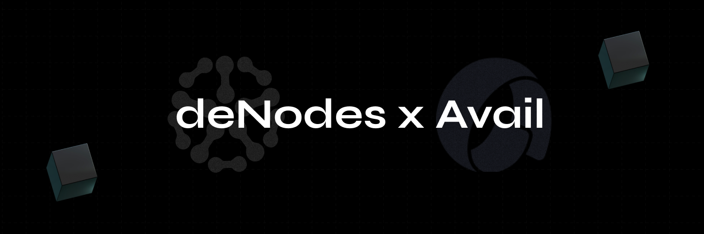

# ⚪ Avail

<figure><figcaption></figcaption></figure>

[<mark style="color:blue;">Avail</mark>](https://availproject.org/) is a modular layer for other blockchains, particularly rollups, to build upon. These rollups can be validity proof-based, optimistic (fraud-proof based), or pessimistic rollups (re-executing all state transitions).

### Table of Contents

* [<mark style="color:blue;">Project Overview</mark>](overview.md)
* [<mark style="color:blue;">Node Setup Guide</mark>](the-node-guide.md)
* [<mark style="color:blue;">FAQ: Most Frequently Asked Questions</mark>](faq.md)
