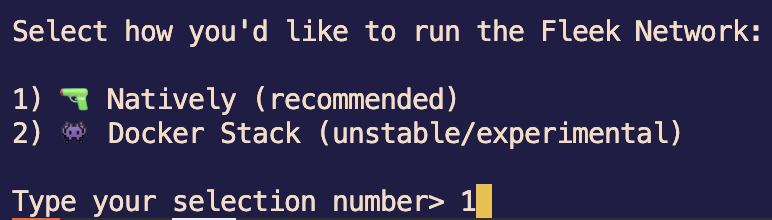
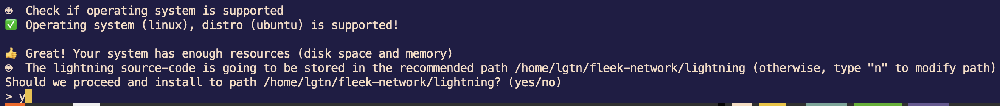
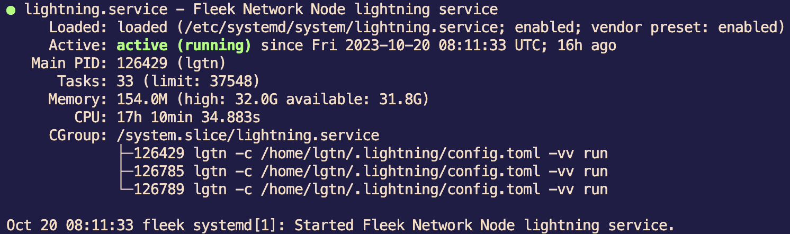
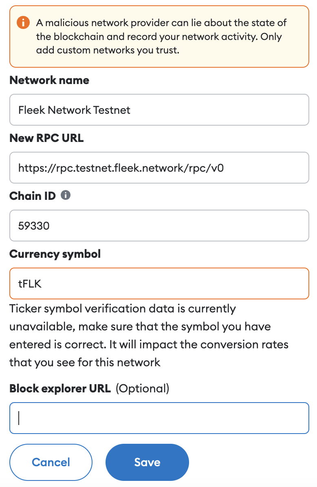
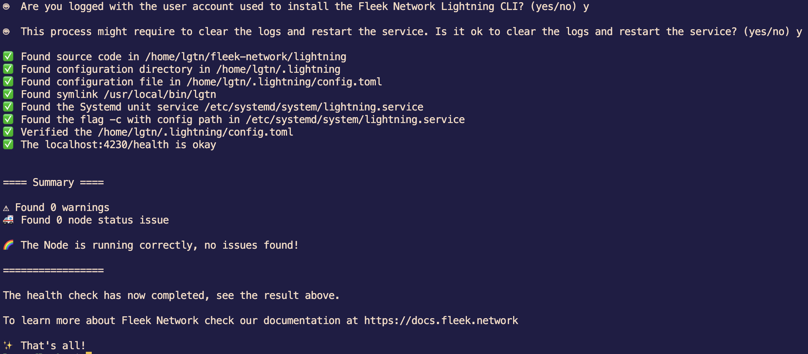

# Node Setup Guide (Outdated)

<figure><figcaption></figcaption></figure>

Welcome to our guide on setting up your node and participating in the [<mark style="color:blue;">Fleek testnet</mark>](https://docs.fleek.network/docs/node/testnet-onboarding/). Follow these step-by-step instructions to get started.

### Hardware Requirements <a href="#hardware-requirements" id="hardware-requirements"></a>

We recommend the following minimum hardware requirements for running the Fleek Node:

* Machine: **CPU 4 Core, 32 GB RAM, 20GB+ SSD**
* OS: **Ubuntu Linux 22.04 (LTS)+, Debian 11+**

## Setting up a Fleek Node

Update system and install requirements:

```bash
apt update && apt upgrade -y
```

### Create user

Create a new user and add it to the _sudo_ group so that it can execute commands as _root_:

<pre class="language-bash" data-line-numbers><code class="lang-bash"><strong>sudo adduser lgtn
</strong>sudo usermod -aG sudo lgtn
su lgtn
cd /home/lgtn
</code></pre>

### Installing <a href="#run-the-script-for-a-quick-install" id="run-the-script-for-a-quick-install"></a>

```bash
curl https://get.fleek.network | bash
```

Installation is as simple as possible. The installer will install all dependencies for you, compile binary files and create service files. During the installation process, select the "Natively" startup method, and answer Yes ("y") to all other questions.

<figure><figcaption></figcaption></figure>

<figure><figcaption></figcaption></figure>


After installation, the private keys will be located in the `/home/lgtn/.lightning/keystore/` directory. Be sure to save them in a secure place.


After completion, start the service:

```bash
sudo systemctl start lightning
```

And make sure it's running:

```bash
sudo systemctl start lightning
```

<figure><figcaption></figcaption></figure>

## Staking tFLK

Test tokens need to be staked for the node to work. The first thing to do is to add the `Fleek Network` to Metamask.


* Network Name: `Fleek Network Testnet`
* RPC URL: `https://rpc.testnet.fleek.network/rpc/v0`
* Chain ID: `59330`
* Currency symbol: `tFLK`

<figure><figcaption></figcaption></figure>

After that, save and switch to Fleek Network. Then visit the [Faucet website](https://faucet.testnet.fleek.network/). You need to connect your wallet on the site. Once `Connect Wallet` is ready, proceed to `Mint tFLK` and wait until the balance of the account in your Metamask increases. You need to have `tFLK` before proceeding.&#x20;

Once `tFLK` balance is available, click in the `Stake` button. You'll be required to provided the following details from your node:

* Node Public Key
* Consensus Public Key
* Server IP Address

You can get the details quickly by running the node details script in the terminal connected to your machine or server where the node is set up and running, as follows:

```bash
curl https://get.fleek.network/node_details | bash
```

The response should include the following details:

```
🤖 Your server details are the following

The Node Public Key is <NODE PUBLIC KEY>
The Consensus Public Key is <CONSENSUS PUBLIC KEY>
The Node Server IP address is <SERVER IP ADDRESS>
```

If the server IP address is not displayed in the command output, you can quickly find it out as follows:

```bash
curl -s eth0.me
```

Copy the corresponding values into the form and confirm the transaction on metamask.

Once the transaction is confirmed by the network, you can again check the node details on the server:

```bash
curl https://get.fleek.network/node_details | bash
```

Now, if everything was successful, the following line will be added to the output:

```
The Node staked amount is 1000 FLK
```

### Health check

Run the following command:

```bash
curl -sS https://get.fleek.network/healthcheck | bash
```

<figure><figcaption></figcaption></figure>

Another way is to run a quick health check by sending a GET request to `/health` endpoint of RPC on [port](https://docs.fleek.network/docs/node/requirements/#ports) 4230.

```
curl -w "\p" localhost:4230/health
```

If successful, you should get the response `running and staked` or `running` if the tokens aren't staked yet.

If you get an error, then it means that your node is not healthy.

### Checking Logs

Standard out and standard error are two data streams created when we launch the Lightning process, on Lightning process activity we redirect the data streams to files as follows:

**Standard output** - The text output from the service process is put in `/var/log/lightning/output.log`

**Standard error** - The error messages from the service process are put in `/var/log/lightning/diagnostic.log`

The log files can be monitored in real-time for diagnosis and troubleshooting purposes and the tail command is the most basic way for this purpose.

You can watch the node standard output (stdout) by running the command:

```
tail -f /var/log/lightning/output.log
```

Or, watch the standard error (stderr) for node diagnostics by running the command:

```
tail -f /var/log/lightning/diagnostic.log
```

## Useful commands

The list of useful commands includes ways to manage your Fleek node:

* **Restart your node**

```
sudo systemctl restart lightning
```

* **Stop your node**

```
sudo systemctl stop lightning
```

* **Check the service status**

```
systemctl status lightning
```

***

_Powered by_ [_<mark style="color:blue;">deNodes</mark>_](https://twitter.com/\_denodes)
