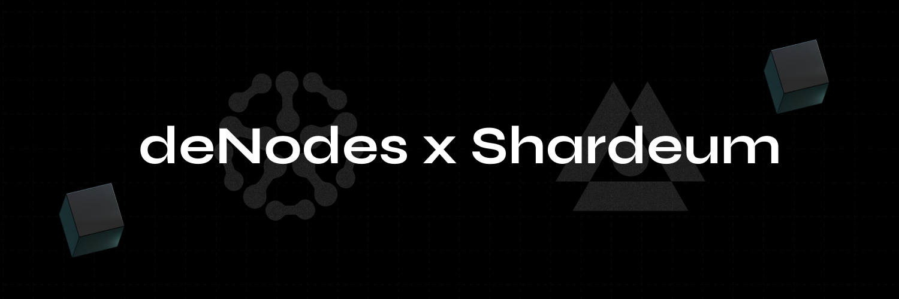

# ⚪ Shardeum

<figure><figcaption></figcaption></figure>

[Shardeum](http://shardeum.org/) is a EVM-compatible blockchain platform specifically designed for developing smart contracts. It stands out by offering low gas fees, full decentralization, and robust data protection through dynamic partitioning.

### Table of Contents

* Project Overview
* Node Setup Guide
* FAQ: Most Frequently Asked Questions
