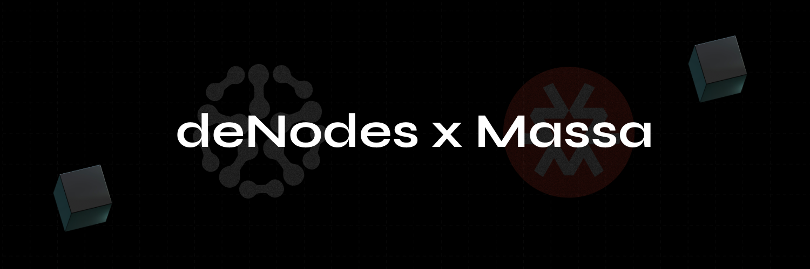

# ⚪ Massa

<figure><figcaption></figcaption></figure>

[Massa Network](https://massa.net/) is a new blockchain project that aims to provide a more decentralized and scalable network with high throughput. It is [designed](https://massa.net/technology) to support up to 10,000 transactions per second using autonomous smart contracts and runs on the Proof-of-Stake consensus algorithm.&#x20;

### Table of Contents

* Project Overview
* Node Setup Guide
* FAQ: Most Frequently Asked Questions

