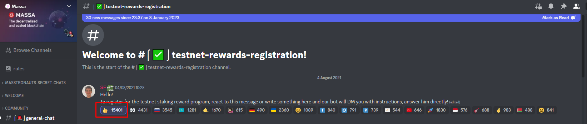
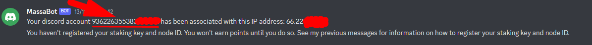

# Node Setup Guide (Outdated)

<figure><figcaption></figcaption></figure>

Welcome to our guide on setting up your node and participating in the Testnet Episode 26, Massa Incentivized Testnet. Follow these step-by-step instructions to get started.


**Please note**: Massa's Incentivized Testnet ended in September 2023.


### Hardware Requirements <a href="#hardware-requirements" id="hardware-requirements"></a>

We recommend the following minimum hardware requirements for running the Massa Node:

* Machine: **8 GB RAM,** **4 Cores CPU, 100 GB SSD**
* OS: **Ubuntu Linux 20.04 (LTS)**

## Setting up a Massa Node

1. Run the following command:

```
wget -q -O massa.sh https://raw.githubusercontent.com/bombermine3/massa/main/massa.sh && bash massa.sh install
```

After installing the node, watch the logs and wait for synchronization:

```
journalctl -u massa-node -f -o cat
```

Next, you need to [create a wallet](the-node-guide.md#creating-a-wallet) and [register the node in Discord](the-node-guide.md#registering-the-node-in-discord).

## Creating a wallet

```
source $HOME/.bash_profile &&
massa_client wallet_generate_secret_key
```

Getting the wallet address:

```
massa_client wallet_info
```

Enable staking for the address. To do this, copy the address and substitute it into the command:

```
massa_client node_start_staking Address
```

Go to Discord to get test tokens

Checking the balance:

```
massa_client wallet_info
```

After tokens have appeared on the balance, buy one ROLL, replacing the Address parameter with your own:

```
massa_client buy_rolls Address 1 0
```

## Registering the node in Discord

To register a node in the Incentivized program, you need to go to the #testnet-rewards-registration channel and click on the "👍🏻" emoji.&#x20;

<figure><figcaption></figcaption></figure>

Next, we receive a private message from MassaBot, send in reply the IP address of your server.&#x20;

<figure><figcaption></figcaption></figure>

Next, go to the terminal and paste the command (replacing the values):

```
massa_client node_testnet_rewards_program_ownership_proof Address Yor_Discord_ID
```

The output of the command needs to be sent back to the bot in Discord.

## Node Monitoring

To view logs, use the following command:

```
journalctl -u massa-node -f -o cat
```

## Updating

```
cd $HOME
systemctl stop massa-node
MASSA_LATEST=`wget -qO- https://api.github.com/repos/massalabs/massa/releases/latest | jq -r ".tag_name"`
wget -qO $HOME/massa.tar.gz "https://github.com/massalabs/massa/releases/download/${MASSA_LATEST}/massa_${MASSA_LATEST}_release_linux.tar.gz"
tar -xvf $HOME/massa.tar.gz
rm -rf $HOME/massa.tar.gz
systemctl start massa-node
```

Then we [re-enable staking](the-node-guide.md#creating-a-wallet) for an address, buy `ROLL`, and [register the node in Discord](the-node-guide.md#registering-the-node-in-discord).

## Useful Commands

The list of useful commands includes ways to manage your Massa node:

* **Restart your node**

```
systemctl restart massa-node
```

* **Stop your node**

```
systemctl stop massa-node
```

* **Delete your node**

```
systemctl stop massa-node
systemctl disable massa-node
rm /etc/systemd/system/massa-node.service
rm -rf $HOME/massa
```

***

_Powered by_ [_<mark style="color:blue;">deNodes</mark>_](https://twitter.com/deNodes\_)
