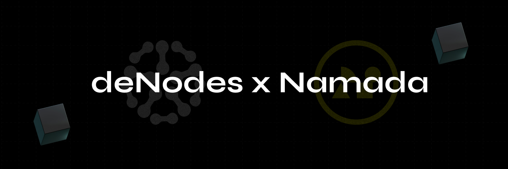

# ⚪ Namada

<figure><figcaption></figcaption></figure>

[<mark style="color:blue;">Namada</mark>](https://namada.net/) is a proof-of-stake blockchain with interchain asset-agnostic privacy. It interoperates with fast-finality chains via IBC and with Ethereum through a trustless bridge.

### Table of Contents

* [<mark style="color:blue;">Project Overview</mark>](project-overview.md)
* [<mark style="color:blue;">Node Setup Guide</mark>](node-setup-guide.md)
* [<mark style="color:blue;">FAQ: Most Frequently Asked Questions</mark>](faq-most-frequently-asked-questions.md)
