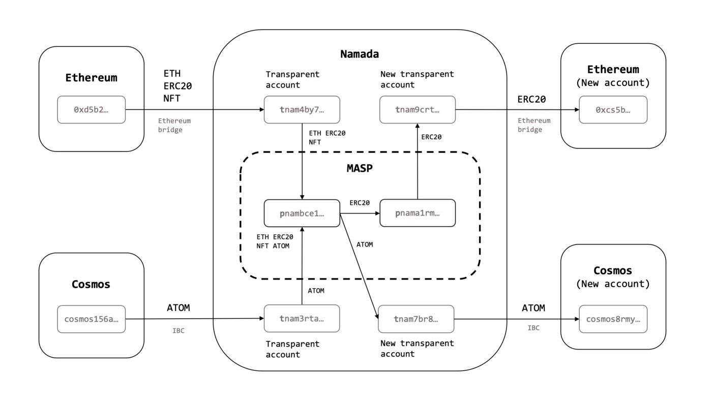

# Project Overview

### Welcome to the Overview of Namada Network!

<figure><figcaption></figcaption></figure>

> Here, you will find detailed information about the Namada architecture, team and backers, resources, and testnet. Let's explore each of these aspects in more details.

## Introduction

The [Namada Network](https://namada.net/) is a decentralized blockchain project that aims to provide asset-agnostic, interchain privacy through its Proof-of-Stake (PoS) layer 1 protocol. The project focuses on ensuring privacy, scalability, and decentralization in blockchain transactions.

The[ Namada Network](https://twitter.com/namada) stands out from other blockchain projects due to several unique features. These include:

* Asset-agnostic privacy for all types of transactions makes it an ideal solution for a wide range of use cases.
* Interoperability across multiple blockchains, enabling seamless transfers of assets across different platforms.
* Scalable throughput through advanced techniques such as sharding and off-chain computation ensures that the network can handle high volumes of transactions.

## What is Namada Network?

Namada Network is designed to provide a secure and private way to make shielded transfers with any kind of asset, whether fungible or non-fungible, across different chains and platforms. The network achieves decentralization by using a Proof-of-Stake (PoS) consensus algorithm. This algorithm motivates validators to act honestly by implementing a system of rewards and penalties.

In addition to its privacy-focused approach, Namada Network is also focused on scalability. The network achieves this through the use of innovative techniques such as sharding and off-chain computation, which enable it to handle high volumes of transactions without sacrificing security or decentralization.

* [<mark style="color:blue;">Introducing Namada: Interchain Asset-agnostic Privacy | Blog - Namada</mark>](https://namada.net/blog/introducing-namada-interchain-asset-agnostic-privacy)

## Namada Network Technology

