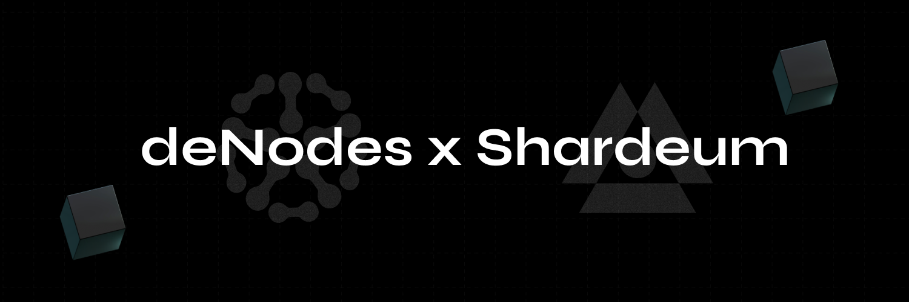

# ⚪ Shardeum

<figure><figcaption></figcaption></figure>

[<mark style="color:blue;">Shardeum</mark>](http://shardeum.org/) is a EVM-compatible blockchain platform specifically designed for developing smart contracts. It stands out by offering low gas fees, full decentralization, and robust data protection through dynamic partitioning.

### Table of Contents

* [<mark style="color:blue;">Project Overview</mark>](overview.md)
* [<mark style="color:blue;">Node Setup Guide</mark>](the-node-guide.md)
* [<mark style="color:blue;">FAQ: Most Frequently Asked Questions</mark>](faq.md)
